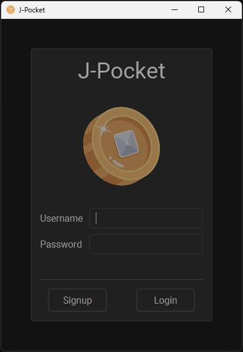
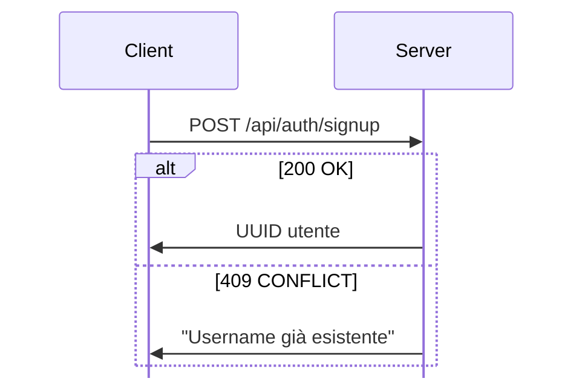
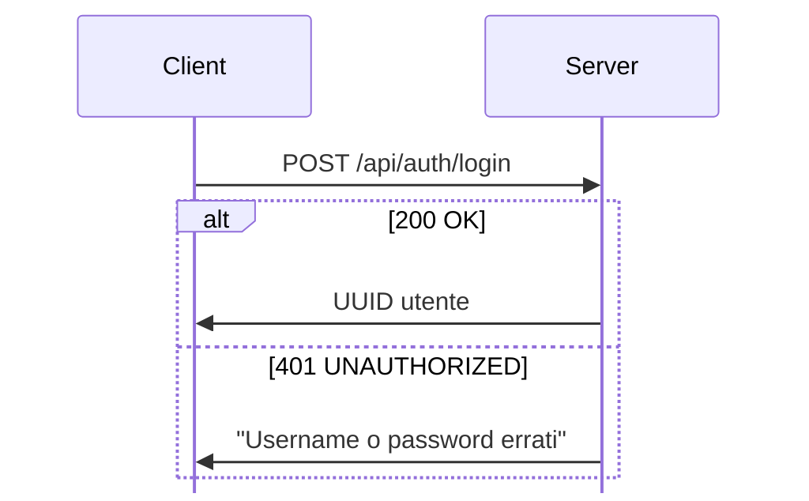
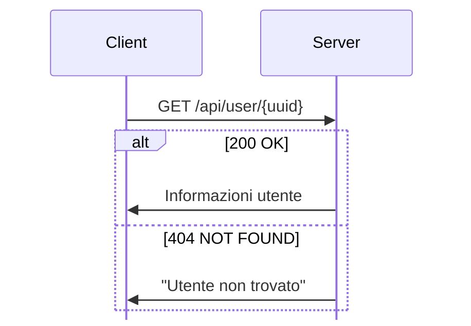
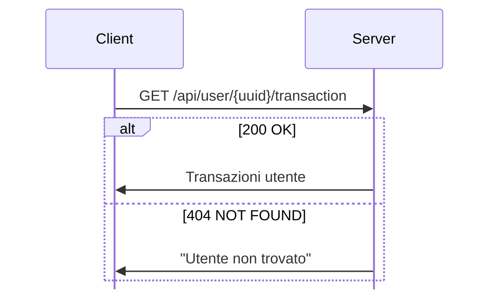
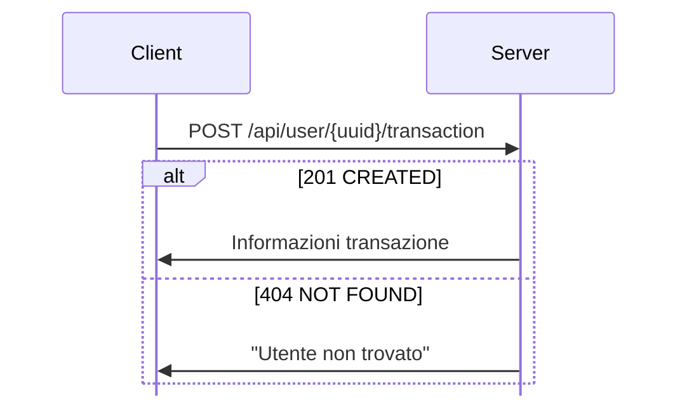
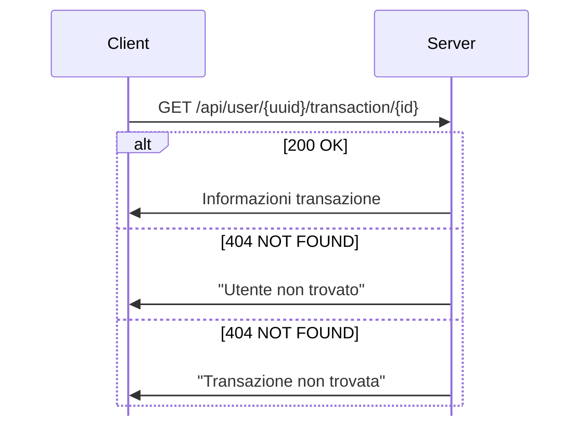
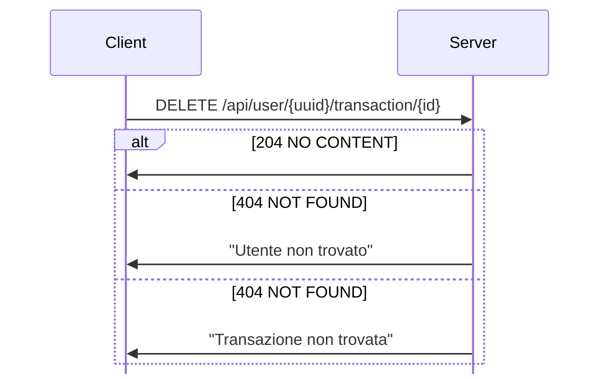

# J-Pocket
J-Pocket è una semplice applicazione desktop multi utente per la gestione di un portafoglio virtuale, dove è possibile tenere traccia di tutte le proprie transazioni. L'applicazione tiene traccia di tutte le transazioni in entrata e in uscita, permettendo di visualizzare i totali di entrambi i tipi di transazioni, e di visualizzare il totale del portafoglio.

## Funzionalità




La prima interfaccia che si presenta all'utente è quella di login, dove è possibile inserire le proprie credenziali per accedere all'applicazione. Se l'utente non è registrato, può cliccare sul pulsante `signup` per creare un nuovo account.

Una volta effettuato il login, l'utente viene reindirizzato alla pagina principale dell'applicazione, dove è possibile visualizzare il totale del portafoglio, il totale delle transazioni in entrata e il totale delle transazioni in uscita. Inoltre, è possibile visualizzare una tabella con tutte le transazioni effettuate dall'utente, le righe della tabella possono essere riordinate cliccando sulle intestazioni delle colonne.\
Per eliminare una transazione è sufficiente selezionare la riga corrispondente, premenre il tasto destro del mouse e selezionare `Remove`.\
Per aggiungere una nuova transazione è sufficiente cliccare sul pulsante rotondo in basso con il simbolo `+` e compilare il form che si apre.

<hr>

## Decrizione tecnica

L'applicazione è stata sviluppata in Java e utilizza il database MySQL per la memorizzazione dei dati.
Il server è stato sviluppato utilizzando il framework Spring Boot, mentre il client è stato sviluppato utilizzando il framework JavaFX.

Il server espone una REST API che consente di effettuare le operazioni CRUD sul database.\
Il client si connette al server tramite una connessione TCP, e invia le richieste al server tramite il protocollo HTTP.

### Endpoint

Gli endpoint esposti dal server sono:

<details>
<summary><a><b>POST /api/auth/signup</b></a></summary>

Questo endpoint consente di registrare un nuovo utente.\
Il body della richiesta deve contenere un oggetto JSON con le seguenti proprietà:

```json
{
    "username": "username",
    "password": "password"
}
```

Le possibili risposte restituite dal server sono:

 - se l'utente è stato registrato correttamente, la risposta restituita è 
**200 OK** e il body della risposta contiene un oggetto JSON contente l'ID dell'utente:
```json
{
    "id": "uuid"
}
```
 - se l'utente è già registrato, la risposta restituita è **409 CONFLICT** e il body della risposta contiene il testo:
```
Username già esistente
```


</details>
<details>
<summary><a><b>POST /api/auth/login</b></a></summary>

Questo endpoint consente di effettuare il login.\
Il body della richiesta deve contenere un oggetto JSON con le seguenti proprietà:

```json
{
    "username": "username",
    "password": "password"
}
```

Le possibili risposte restituite dal server sono:

 - se l'utente si è autenticato correttamente, la risposta restituita è 
**200 OK** e il body della risposta contiene un oggetto JSON contente l'ID dell'utente:

```json
{
    "id": "uuid"
}
```
 - se l'utente non è registrato, la risposta restituita è **401 UNAUTHORIZED** e il body della risposta contiene il testo:
```
Username o password errati
```


</details>
<details>
<summary><a><b>GET /api/user/{uuid}</b></a></summary>

> **Nota**: Questo endpoint non viene utilizzato dal client, ma è stato creato per possibili implementazioni future.

Questo endpoint consente di ottenere le informazioni dell'utente e le sue transazioni effettuate.\
L'ID dell'utente deve essere passato come parametro nell'URL.\
Le possibili risposte restituite dal server sono:

 - se l'utente esiste, la risposta restituita è **200 OK** e il body della risposta contiene un oggetto JSON con le seguenti proprietà:
```json
{
    "id": "c4ba5f96-c518-4915-801d-34e9a335be8d",
    "username": "user",
    "password": "pass",
    "transactions": [
        {"id": 1},
        {"id": 2}
    ]
}
```
 - se l'utente non esiste, la risposta restituita è **404 NOT FOUND** e il body della risposta contiene il testo:
```
Utente non trovato
```


</details>

<details>
<summary><a><b>GET /api/user/{uuid}/transaction</b></a></summary>

Questo endpoint consente di ottenere tutte le transazioni effettuate dall'utente.\
L'ID dell'utente deve essere passato come parametro nell'URL.\
Le possibili risposte restituite dal server sono:

 - se l'utente esiste, la risposta restituita è **200 OK** e il body della risposta contiene un array JSON con le seguenti proprietà:
```json
[
    {
        "id": 1,
        "title": "Stipendio",
        "amount": 1000.0,
        "date": "2020-12-01T00:00:00.000+00:00",
        "type": 0
    },
    {
        "id": 2,
        "title": "Pizza",
        "amount": 6.5,
        "date": "2020-15-01T00:00:00.000+00:00",
        "type": 1
    }
]
```
 - se l'utente non esiste, la risposta restituita è **404 NOT FOUND** e il body della risposta contiene il testo:
```
Utente non trovato
```


</details>

<details>
<summary><a><b>POST /api/user/{uuid}/transaction</b></a></summary>

Questo endpoint consente di creare una nuova transazione per l'utente.\
L'ID dell'utente deve essere passato come parametro nell'URL.\
Il body della richiesta deve contenere un oggetto JSON con le seguenti proprietà:
```json
{
	"title": "Stipendio",
	"amount": 1000.0,
	"date": "2020-12-01T00:00:00.000+00:00",
	"type": 0
}
```

Le possibili risposte restituite dal server sono:

 - se l'utente esiste, la risposta restituita è **201 CREATED** e il body della risposta contiene un oggetto JSON con le seguenti proprietà:
```json
{
	"id": 1,
	"title": "Stipendio",
	"amount": 1000.0,
	"date": "2020-12-01T00:00:00.000+00:00",
	"type": 0
}
```
 - se l'utente non esiste, la risposta restituita è **404 NOT FOUND** e il body della risposta contiene il testo:
```
Utente non trovato
```


</details>

<details>
<summary><a><b>GET /api/user/{uuid}/transaction/{id}</b></a></summary>

> **Nota**: Questo endpoint non viene utilizzato dal client, ma è stato creato per possibili implementazioni future.

Questo endpoint consente di ottenere le informazioni di una transazione effettuata dall'utente.\
L'ID dell'utente deve essere passato come parametro nell'URL.\
L'ID della transazione deve essere passato come parametro nell'URL.\
Le possibili risposte restituite dal server sono:

 - se l'utente e la transazione esistono, la risposta restituita è **200 OK** e il body della risposta contiene un oggetto JSON con le seguenti proprietà:
```json
{
	"id": 1,
	"title": "Stipendio",
	"amount": 1000.0,
	"date": "2020-12-01T00:00:00.000+00:00",
	"type": 0
}
```
 - se l'utente o la transazione non esistono, le risposte restituite sono **404 NOT FOUND** e i body delle risposte contiengono rispettivamente:
```
Utente non trovato
```
```
Transazione non trovata
```


</details>

<details>
<summary><a><b>DELETE /api/user/{uuid}/transaction/{id}</b></a></summary>

Questo endpoint consente di eliminare una transazione effettuata dall'utente.\
L'ID dell'utente deve essere passato come parametro nell'URL.\
L'ID della transazione deve essere passato come parametro nell'URL.\
Le possibili risposte restituite dal server sono:

 - se l'utente e la transazione esistono, la risposta restituita è **204 NO CONTENT** e il body della risposta è vuoto.
 - se l'utente o la transazione non esistono, le risposte restituite sono **404 NOT FOUND** e i body delle risposte contiengono rispettivamente:
```
Utente non trovato
```
```
Transazione non trovata
```


</details>

<br></br>

### Dettagli Tecnici

Il progetto è diviso in due cartelle principali:

 - **client**: contiene il codice sorgente del client.
 - **server**: contiene il codice sorgente del server.

Il Server si collega al database tramite un file di configurazione che si trova nella cartella **server** e si chiama **`application.properties`**.\
La porta di connessione al database è impostata a **`3306`**.\
Il nome del database è **`615682`**, l'utente  è **`root`** e la password è **`root`**.\
Se il database non esiste, viene creato automaticamente.\
All'avvio del server, vengono create le seguenti tabelle:
 - **`user(id,username,password)`**: contiene le informazioni degli utenti.
 - **`transaction(id,title,amount,date,type,user_id)`**: contiene le informazioni delle transazioni effettuate dagli utenti.

Vengono anche dei dati di esempio:
 - 2 utenti:
   - `(1,'admin', 'admin')`
   - `(2,'user', 'user')`
 - 4 transazioni:
   - `('Stipendio', 1000, '2019-01-01', 0, 1)`
   - `('Spesa', 500, '2019-01-01', 1, 2)`
   - `('Stipendio', 1000, '2019-01-01', 0, 2)`
   - `('Spesa', 500, '2019-01-01', 1, 1)`

Sono presenti anche 2 test di unità per il server, che si trovano nella cartella `/server/src/test/java/it/unipi/jpocket/server/AuthControllerTests.java`.\
I test verificano che la struttura e le risposte del server per i seguenti endpoint siano corrette:
 - **`POST /api/auth/login`**
 - **`POST /api/auth/signup`**
  
Per eseguire i test, è necessario eseguire il comando `mvn test` nella cartella `/server`.